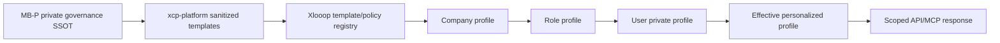
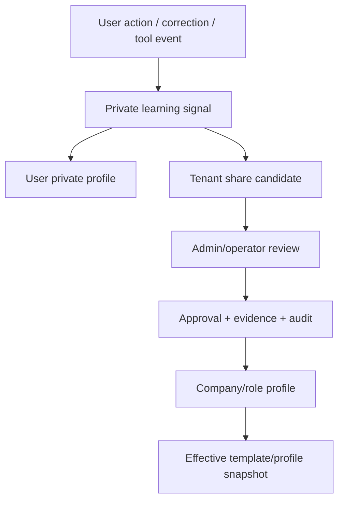

# Customer Learning Personalization Architecture

Xlooop personalizes at three customer-safe layers:

1. **Company profile** — tenant-approved roles, terminology, workflow defaults,
   and shared skills.
2. **Role profile** — company-approved defaults for a job family such as owner,
   analyst, operator, accountant, inspector, or developer.
3. **User private profile** — personal preferences, personal rules, preferred
   skills, learned defaults, and correction history.

The user profile is private by default. A personal learning signal becomes a
company-level pattern only through explicit promotion with consent, approval,
evidence, and audit.

## Control Plane

Customer APIs never return raw MB-P files, private graph schema, governance
scoring, secrets, or broad memory. They return effective redacted projections
with source, approval, and audit references.

The customer experience should not surface this internal architecture. Company
admins and employees should experience it as safe defaults, useful role packs,
personal preferences, and remembered corrections. MB-P governance and the
pillar model stay internal control-plane standards; Xlooop exposes only the
tenant-safe behavior and effective snapshots needed for the user workflow.

## Learning Flow

## Allowed Personalization

- Wording, examples, defaults, terminology, workflow preferences.
- User-specific role hints, skill preferences, digest style, reminder cadence,
  and evidence presentation style.
- Company-approved shared role packs and company terminology.
- Explicit user corrections, repeated tool choices, preferred evidence format,
  personal shortcuts, personal rules, personal skills, and learned defaults.

Personalization has three promotion levels:

1. `user_private` — available only to that user in that tenant.
2. `tenant_share_candidate` — user-approved candidate for company reuse.
3. `tenant_shared` — admin/operator-approved company or role profile entry.

## Forbidden Weakening

Lower layers must not weaken:

- tenant isolation
- redaction
- retention
- approvals
- tool permissions
- evidence requirements
- RCA requirements
- forbidden API/MCP surfaces

The backend rejects learning payloads that try to set governance/security keys
such as `security`, `retention`, `approval`, `redaction`, `tenant_isolation`,
`raw_graph`, `full_tenant_memory`, `governance_scoring`, `agent_routing`,
`private_graph_schema`, `secrets`, or `search_all_memory`.

## API/MCP Posture

Codex, Claude Code, Cursor, and other clients may use Xlooop scoped API/MCP
tools, but they are not graph authority. They may read effective profiles and
submit learning signals. Company-level promotion remains native, approved, and
audited.

Current Codex desktop sessions still enter through `mb-p-gateway` because MB-P
is the governance SSOT. Xlooop API/MCP is the customer/product runtime
projection. Switching a Codex session to native Xlooop tools requires a
separate exposed connector/tool namespace; until then the safe path is the
terminal/API parity harness with scoped service-principal tokens.

Recommended connector posture:

- Keep `mb-p-gateway` as the required governance entrypoint for MB-P/XCP work.
- Expose Xlooop as a separate customer connector, for example
  `xlooop-customer-gateway`, once the runtime can load it.
- First call through that connector must be `xlooop.whoami`.
- Every request must re-check token validity, tenant membership, DB RBAC, and
  scope.
- Allowed connector tools are limited to `xlooop.whoami`, scoped packet read,
  effective template/profile read, private learning-signal submission, status
  and metrics, evidence submission, tool-event reporting, and approval request.
- Xlooop MCP tools may call scoped customer APIs, but they must not return raw
  MB-P governance, private graph schema, broad memory, or internal routing
  logic.
- Connector clients may create only scoped records or `GraphSuggestion`
  candidates. Authoritative graph writes remain native, reviewed, approved, and
  audited.
